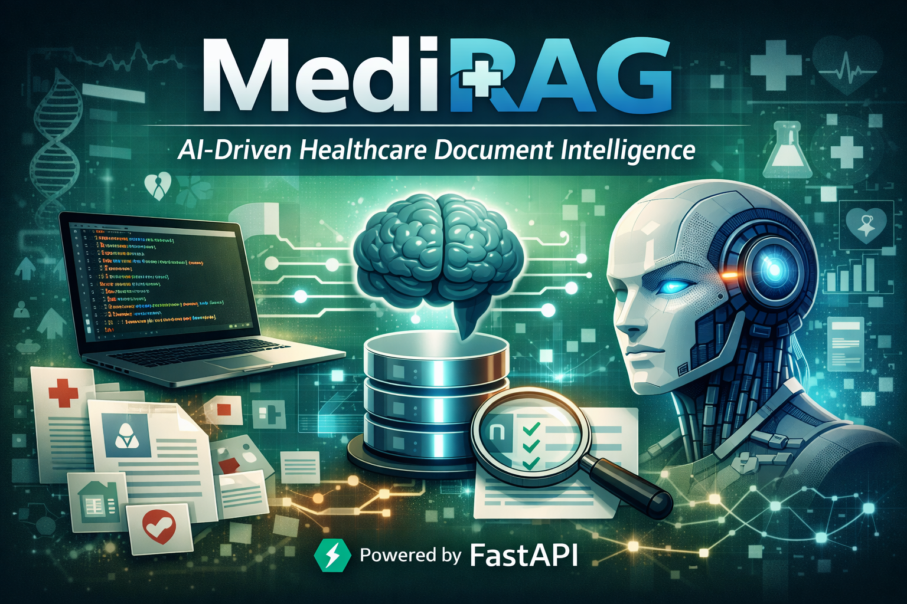

<p align="center">
  
</p>
 
# Healthcare Document Intelligence with GenAI (MediRAG)

MediRAG is a Healthcare / Pharma Document Intelligence system designed to ingest complex documents (e.g., Prior Authorizations, Pharmacy Agreements) and transform them into structured, reliable, and auditable data using GenAI + Retrieval-Augmented Generation (RAG).

> Status: Backend MVP is fully functional (API + DB + migrations + PDF ingestion + page-level processing + vector indexing + agentic QA + testing). The system is evolving into a production-grade Agentic Workflow architecture.

---

## Business Problem (Why This Exists)

Reviewing Prior Authorization and Pharmacy documents is slow, manual, and error-prone. Teams spend significant time reading PDFs, extracting key fields, and justifying decisions for compliance.

This system addresses that by:
- Extracting structured data from unstructured documents
- Preserving traceable evidence (page-level + chunk-level)
- Enabling grounded AI responses with citations
- Supporting audit-ready decision workflows

---

## Key Value Proposition

- Reduce manual review time
- Increase extraction accuracy
- Provide full traceability for every decision
- Enable scalable document intelligence pipelines in healthcare/pharma

---

## ROI Metrics

- Time-to-review (TTR) per document (minutes)
- Documents processed per day per reviewer
- Field-level correction rate
- Evidence coverage (target: 100%)
- System metrics (p95 latency, failure rate)

---

## System Architecture (High-Level)

The system follows an Agentic RAG Workflow:

1. Ingestion Layer
   - PDF upload and storage
2. Processing Layer
   - Page-level text extraction
   - Structured persistence in database
3. Indexing Layer
   - Embedding generation
   - Storage in vector database (Weaviate)
4. Retrieval Layer
   - Semantic search with top-k ranking
5. Agentic Reasoning Layer
   - Planner → Retriever → Verifier workflow
   - Multi-query generation
   - Grounded response validation
6. Output Layer
   - Structured JSON responses
   - Citations + reasoning trace
   - Audit-ready outputs

---

## Core Features

### Backend API (FastAPI)
- OpenAPI docs: `GET /docs`
- Health checks: `GET /health`, `GET /rag/health`

### Database (PostgreSQL + SQLAlchemy)
- ORM-based persistence
- Alembic migrations
- Page-level document storage

### Document Processing
- Upload: `POST /documents`
- Processing: `POST /documents/{document_id}/process`
- Page retrieval:
  - `GET /documents/{document_id}/pages`
  - `GET /documents/{document_id}/pages/{page_number}`

### Vector Indexing (Weaviate)
- `POST /documents/{document_id}/index`
- Stores semantic chunks for retrieval (Weaviate collection: `DocumentChunk`)

### Agentic RAG QA
- `POST /rag/answer`
- Features:
  - Multi-query planning
  - Semantic retrieval (top-k)
  - Groundedness verification
  - Step-by-step trace (`steps`)
  - Citation-based answers
  - Evaluation mode (`allow_insufficient=false`) to disallow refusal answers

### Structured Extraction
- `POST /rag/extract`
- Schema-driven output
- Automatic indexing remediation (index-if-missing)

---

## AI Reliability & Risk Handling

- Parsing failures → fallback to manual review
- Large documents → pagination controls
- AI degradation → fallback strategies (planned):
  - Keyword search (FTS)
  - Async processing queues
  - Circuit breaker for AI modules

---

## Local Setup Guide

### 1. Start PostgreSQL
```

bash cd healthcare-genai-rag docker compose up -d docker ps``` 

### 2. Configure Environment Variables
Create a `.env` file in:
```

healthcare-genai-rag/.env``` 

Example:
```

env DATABASE_URL=postgresql+psycopg://<DB_USER>:<DB_PASSWORD>@127.0.0.1:5432/<DB_NAME>
OPENAI_API_KEY=<YOUR_OPENAI_KEY> OPENAI_MODEL=<CHAT_MODEL_NAME> OPENAI_EMBEDDINGS_MODEL=<EMBEDDINGS_MODEL_NAME>
WEAVIATE_URL=<WEAVIATE_CLUSTER_URL> WEAVIATE_API_KEY=<WEAVIATE_API_KEY>``` 

### 3. Install Dependencies
Activate virtual environment:

**Windows**
```

bash .venv\Scripts\activate``` 

**Mac/Linux**
```

bash source .venv/bin/activate``` 

Install:
```

bash pip install -r requirements.txt``` 

### 4. Run Migrations
```

bash alembic upgrade head``` 

### 5. Start API
```

bash python -m uvicorn app.main:app --reload``` 

Swagger UI:
```

http://127.0.0.1:8000/docs``` 

---

## Testing
```

bash pytest -q``` 

---

## Example Usage

### Upload → Process → Index
```

text POST /documents POST /documents/{document_id}/process POST /documents/{document_id}/index``` 

### Agentic QA example
```

json { "document_id": "<DOCUMENT_ID>", "question": "What is the decision and the rationale?", "top_k": 8, "retries": 1 }``` 

### Evaluation mode
Use `allow_insufficient=false` to disallow `"Insufficient evidence."` responses (useful for evaluation/testing).
```

json { "document_id": "<DOCUMENT_ID>", "question": "Confirm the decision is denied and justify the rationale.", "top_k": 8, "retries": 0, "allow_insufficient": false }``` 

---

## Security Best Practices

- Never commit `.env` files
- Avoid real healthcare data in local environments
- Rotate API keys regularly

---

## Roadmap

- Hybrid retrieval (FTS + semantic)
- Async pipeline (queue-based architecture)
- Observability (logs, metrics, tracing)
- Human-in-the-loop review UI
- Full Agentic Workflow orchestration layer

---

## Why This Project Matters (For Recruiters)

This project demonstrates:
- Real-world GenAI application in healthcare
- End-to-end RAG system design
- Agentic workflow implementation (planner/retriever/verifier + evaluation mode)
- Production-ready backend engineering (FastAPI, DB, migrations)
- Focus on reliability, auditability, and scalability

---

## Git Workflow
```

bash git status git add README.md Overview.txt healthcare-genai-rag/app healthcare-genai-
rag/tests healthcare-genai-rag/requirements.txt git commit -m "Add agentic RAG workflow with evaluation mode and production structure" git push
